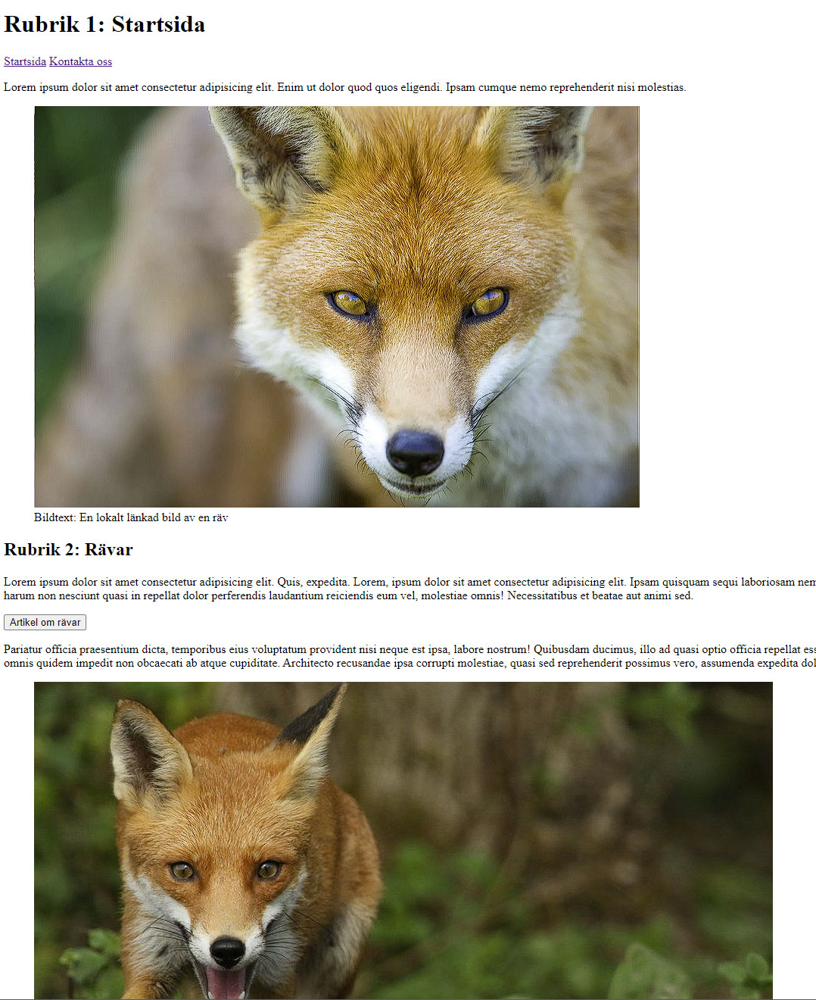

# Exercise 1: First HTML page
Feel free to experiment with more awsome html-details.
## Startpage
- [ ] Create a new file called index.html
- [ ] Create the following elements
  - doctype
  - html
  - head
  - body
- [ ] Place all necessary meta-tags inside de head, inkluding webbpage-name, description, etc
- [ ] Create the following content, inside correct element
  - a header
  - a heading inside the header-element, with the text "Home"
  - three longer text (max 250 words, lorem ipsum), with headings
  - at least two images, where one is insida a folder and the other from a external page on Internet
  - a menu, with two links one called home and and one called contact
  - a button with a link to another webpage on the Internet
## Contact page
- [ ] Create a new file called contact.html
- [ ] Copy-and-paste everything from your index.html file, but change the text in the heading inside the header-element to "Contact us"
- [ ] Link the pages, so it is possible to navigate between the two web-pages
- [ ] Delete one of the images, and replace the other with a new one
- [ ] In the contact-file, create a form with at least the following
  - set action to "mailto:firstname.lastname@mymail.eu"
  - a name label and an input
  - a lastname label and an input
  - a message label and a textarea
  - a submit and a reset button
# A possible solution
## A start page

## A contact page

## A close-up on the form

