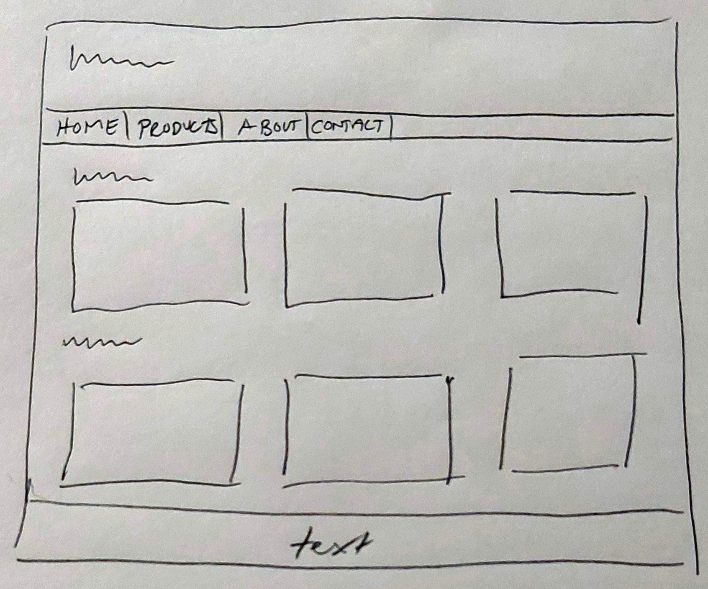
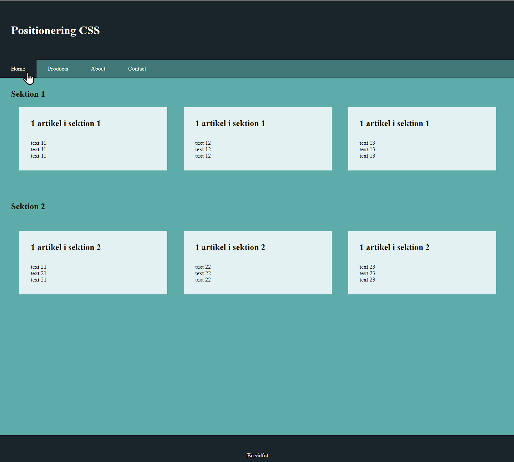

# 3 CSS | positioning

Pathname: 3-css-positioning

The purpose of the task is to experiment with basic layout tools in css, such as the box model, column layout, multi-columns, margins, padding, the properties display, float, clear, etc. Since bootstrap mainly builds on flex-box, the exercise also includes a part where the ability to practice this tool is included.

## In addition to layout tools in css, the following must be implemented/included

1. Documentation of the working process with wireframes for each individual website. The wireframes should be placed in a separate folder named wireframes

2. All CSS rules must be contained in a separate style sheet file, where appropriate selectors and selector-rules should be used

3. Images and background image should be used

4. At least the following background properties, with *shorthands* where its appropriate, should be used in some way
    1. background-color
    2. background-image
    3. background-repeat
    4. background-position

5. Google fonts

## Additional instructions

1. This is a group effort, and as such uses github (and Live Share where appropriate).

2. Your repo should include, in addition to all other files
    1. a README.md, where the website/project is described 
    2. a file called logbook.md, a written account of who did what
    3. optional: .gitignore

Pleaas do *not* use JavaScript for this task.

## Part one

1. Clone the excersise (this repo). Create on in your own account, and either make it public or invite your coworker to it.

2. Open DevTools for warnings/errors. Correct the errors. Ignore if JavaScript errors appears.

3. Add other necessary meta tags like author, description, keywords, etc

4. Create an external css file in a folder named style, and link it in the head element

5. Why is the text "Section 1", placed inside a section smaller than the text "Positioning CSS" in the header since both are placed in a h1? Change so they are equal, when you understand the answer.

6. Position the content according to the wireframe of the task, only using *diplay, float* and *position*

### A lo-fi wireframe

### A more hi-fi (well) wireframe

## Part two

6. Now, make some wireframes for the rest of the webbsites pages. Its ok if they are lo-fi. Bring them in to the groups Github repository.

- **products** should have placeholders for a gallery where the products picture will be shown, buttons and some info for at least 12-15 products
- **contact** should contain at least one well-suited picture, and a form
- **about** should contain at least informtiion of the company (lorem ipsum is fine), and som photos of at least three staff-memebers

## Part three

7. Use your CSS-skills to make create at least the about.html so that the layout look like the wireframes you just made. Feel free to create it in whatever technology you consider suitable; grids, column layout, flex box, etc.

Optional. If you decide to also create the products.html, then flex-box **must be used** to create the gallery where pictures of at least three employees are to be placed.
