- [Live server problem & att hosta på github.pages](#live-server-problem--att-hosta-på-githubpages)
  - [VSCode projekt folder](#vscode-projekt-folder)
  - [GitHub Pages](#github-pages)
- [Städa i git](#städa-i-git)
  - [Hur man jobbar i GitHub (reminder)](#hur-man-jobbar-i-github-reminder)
  - [Hur man rensar i sin git repo](#hur-man-rensar-i-sin-git-repo)
    - [.gitignore](#gitignore)
    - [git i Terminalen](#git-i-terminalen)
- [Rörelse med CSS](#rörelse-med-css)
- [Transition](#transition)
- [Animation](#animation)

# Live server problem & att hosta på github.pages

Vilken folder man har öppen i VSCode påverkar vilken URL man sen hostar sin hemsida på när man använder `Live Server`.

## VSCode projekt folder

Här ser man att själva projektfoldern är öppnad.  
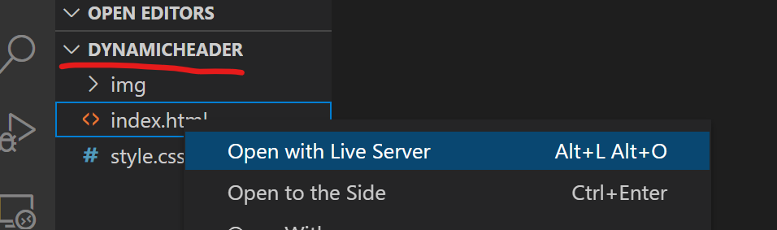  
Path:en i URL:en blir "/index.html".  
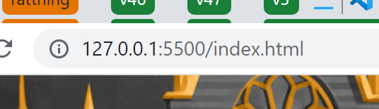

Här ser man att en folder ovanför projektfoldern är öppnad.  
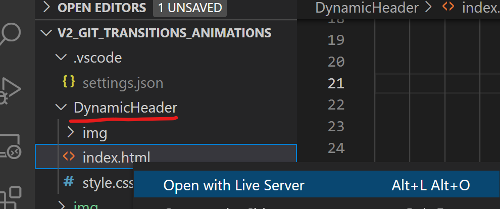  
Path:en i URL:en blir "/DynamicHeader/index.html".  
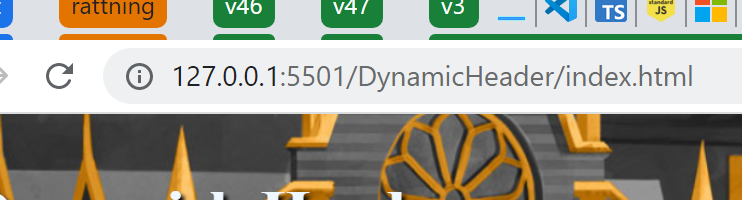

Därför är det bra om alla länkarna på hemsidan är _relativa_ istället för _statiska_. Då spelar det inte någin roll om hemsidan är hostad på
`127.0.0.1:5500/DynamicHeader/` eller `127.0.0.1:5500/`.

## GitHub Pages

När man lägger upp sin hemsida på [GitHub Pages](https://docs.github.com/en/pages/getting-started-with-github-pages/creating-a-github-pages-site#creating-your-site) (en gratis statisk hemsidehosting tjänst) så får varje sida man lägger upp en liknande prefix motsvarande namnet på projektets GitHub repo.

Därför är det viktigt att alla interna länkar är relativa även i detta fallet om man vill att ens sida ska både fungera när man testar med Live Server och när man sen hostar den på GH Pages.

https://github.com/bjorn-stromberg-codic/dynamic-header

https://bjorn-stromberg-codic.github.io/dynamic-header/

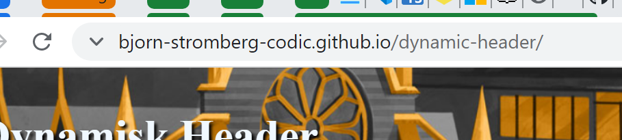

<br>

# Städa i git

## Hur man jobbar i GitHub (reminder)

- Man lägger endast till nya commits till master genom PR från en issue branch till master brancen
- Man mergar aldrig _in_ till en master branch, bara _från_
- Om det står i PR att det finns en konflikt mellan master och en issue branch så
  löser man det genom att:
  1. Uppdatera den lokala master branchen
  2. Lokalt merga master till issue branchen
  3. Kolla att allt står väl till, lös eventuella konflikter
  4. Pusha din issue branch och därmed uppdatera PR automatiskt
  5. Om inget nytt har hänt så ska det nu gå att genomföra och avsluta PR

## Hur man rensar i sin git repo

Det händer ibland att man råkar committa med filer som är automatiskt genererade såsom `bin/` och `obj/` foldrarna i ett C# projekt eller konstiga filer inne i `.vs` eller `.vscode`.

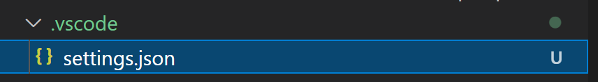
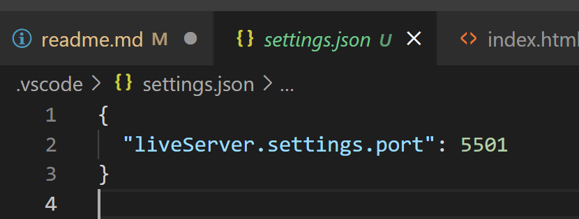

Det är lätt hänt att man råkar committa in filer som dessa, men när man väl har gjort det en gång, hur blir man då av med dem sen?

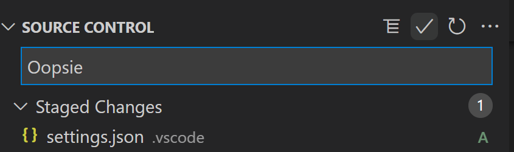

> **OBS!** Allt detta bör göras på `master` branchen av en ansvarig, då är det lätt för resten av teamet att direkt efter uppdatera sin `issue` branch genom att merga in från `master`.

### .gitignore

Första steget är att lägga till en `.gitignore` regel för att ignorera filen eller foldern i framtiden.

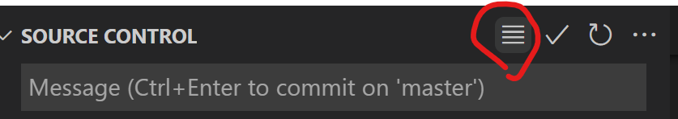
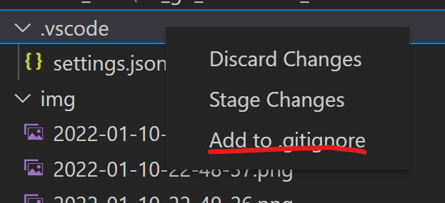

Om det inte fanns en `.gitignore` sen tidigare så skapas en default med massa existerande ignoreringsregler.

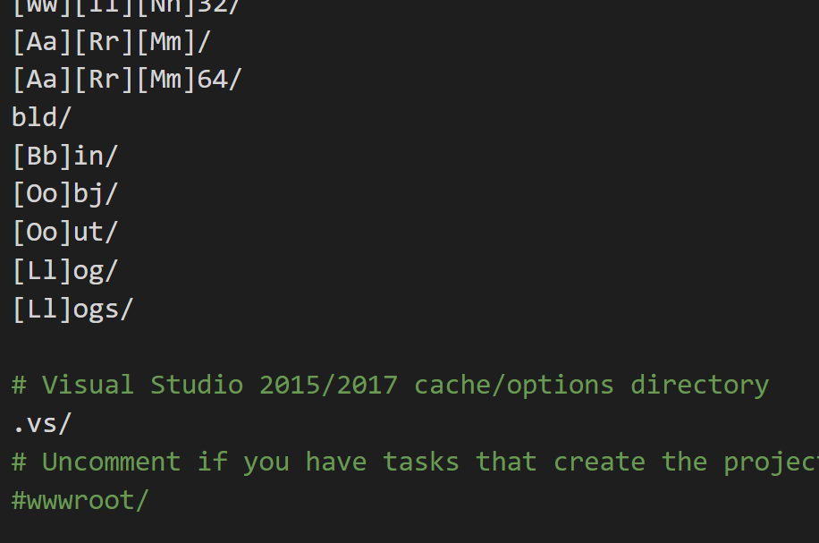

Såhär ser det ut när `bin/` och `.vs/` foldrarna ignoreras.
Läs gärna på för [hur du kan redigera den](https://www.w3schools.com/git/git_ignore.asp) manuellt.

De filer och foldrar som inte är committade sen tidigare och som är nämnda i `.gitignore` dyker inte upp som förslag när man ska committa.

> Före:  
> 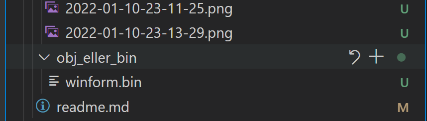

> Efter:  
> 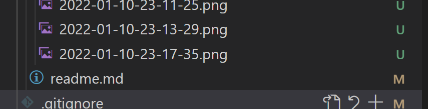  
> Inne i `.gitignore` längst ner  
> 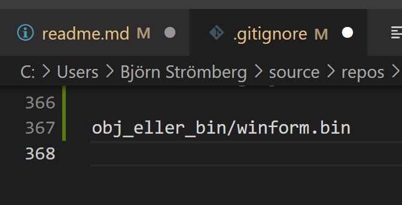

### git i Terminalen

Filer vi dock redan råkat committa försvinner inte bara för att vi ignorerar dem. De måste rensas från `git`s indexering med.

Detta kan man bara göra via terminalen, så installera [git](https://git-scm.com/downloads) om du inte gjort det och starta upp terminalen  
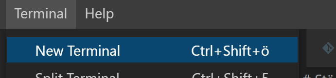

> Terminalen är ett annat sätt att kolla runt i datorns filsystem som nästan uteslutande används av administratörer och programmerare.
>
> När du startar terminalen i VSCode så börjar du i foldern som VSCode är öppen i. Här kan du köra olika kommandon.
>
> - `dir` kan användas för att titta vad som finns i foldern du står i just nu
> - `cd [path]` kan användas för att röra sig till en annan folder
> - `cd ..` för att vandra upp ett steg
> - `cd in/i/folder` för att gå ner i foldrar
> - `git status` kan användas för att kolla läget i närmsta git repo härifrån och upp

Detta kommando nedan är det magiska kommando som används för att plocka bort saker vi redan råkat committa.

`git rm -r --cached [path]`

- `git` är programmet
- `rm` står för _remove_
- `-r` står för _rekursiv_ och behövs om vi plockar bort en folder
- `--cached` är till för att endast avindexera filen utan att radera den på riktigt. Filen finns alltså kvar, det är bara att `git` glömt att den finns.

Såhär blev det när jag körde det:  
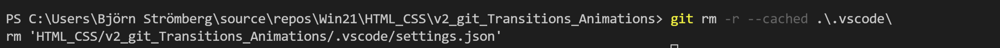  


Ignorerade filer ser gråa ut i Explorer vyn:  
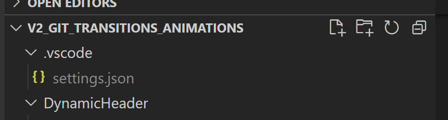

<br>

# Rörelse med CSS

Bara vissa saker kan röra på sig och variera:
https://developer.mozilla.org/en-US/docs/Web/CSS/CSS_animated_properties

# Transition

https://css-tricks.com/almanac/properties/t/transition/

Det finns en header i `DynamicHeader` projektet som är `300px` hög, men sitter i en wrapper som är `100px` hög.

Den är positionerad med `position: absolute` så att bottnen sitter jämt med wrapper bottnen.

1. Lägg till en transition som gör att `<header>` åker ner `200px` och visar länkarna när man sätter musen ovanför. (via `:hover`)

2. Lägg till så att "Dynamisk Header" titeltexten växer och blir större samtidigt som headern glider ner. (Tips: `:hover` ska inte sitta på `h1`)

3. (bonus) Ha att länkar i headern växer fram:

   - en färgbakgrund
   - en skugga
   - rundade hörn

   när man hovrar över dem så att de blir till knappar.

# Animation

https://css-tricks.com/almanac/properties/a/animation/

1. Lägg till en engångsanimation till headern där den börjar 50px längre ner än normalt och sen åker tillbaka till sitt "startläge".

2. Lägg till en loopande animation som försiktigt rör länktexten upp och ner när man hovrar över en header länk med musen.

3. (bonus) Animera individuella länkbokstäver:  
   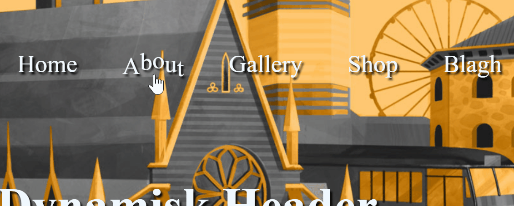
   
   - Slå in varje bokstav i länken i en `<span>`.
   - Ändra på animationen från steg `2` så att den gäller på varje `<span>` inne i länken när man hovrar på länken.
   - Använd `:nth-child` upprepade gånger likt nedan för att ställa in olika offsets på animeringen per `<span>`.
      ```css
      li:nth-child(1) { animation-delay: 1s; }
      li:nth-child(2) { animation-delay: 2s; }
      li:nth-child(3) { animation-delay: 3s; }
      li:nth-child(4) { animation-delay: 4s; }
      li:nth-child(5) { animation-delay: 5s; }
      li:nth-child(6) { animation-delay: 6s; }
      li:nth-child(7) { animation-delay: 7s; }
      li:nth-child(8) { animation-delay: 8s; }
      ```
